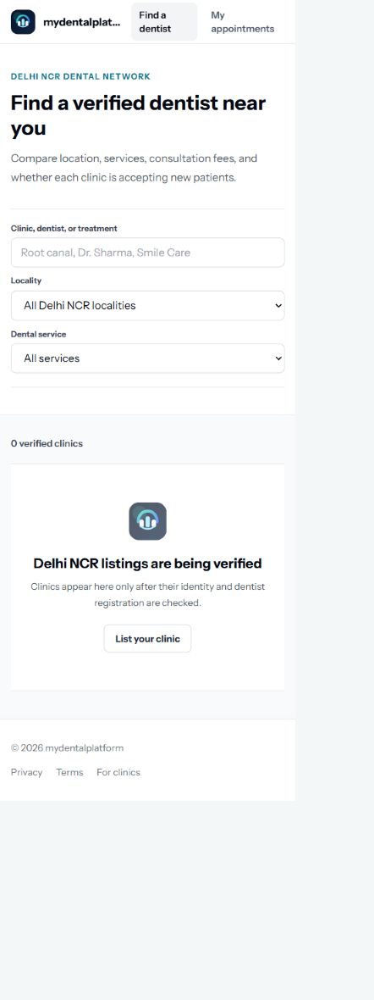
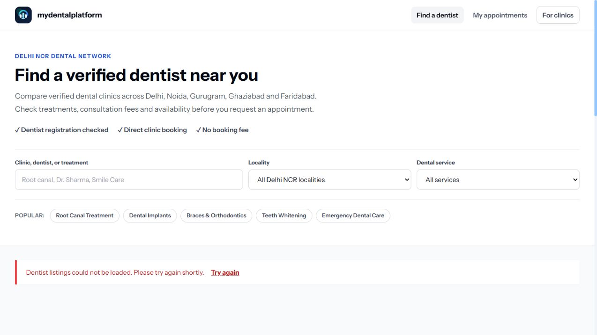
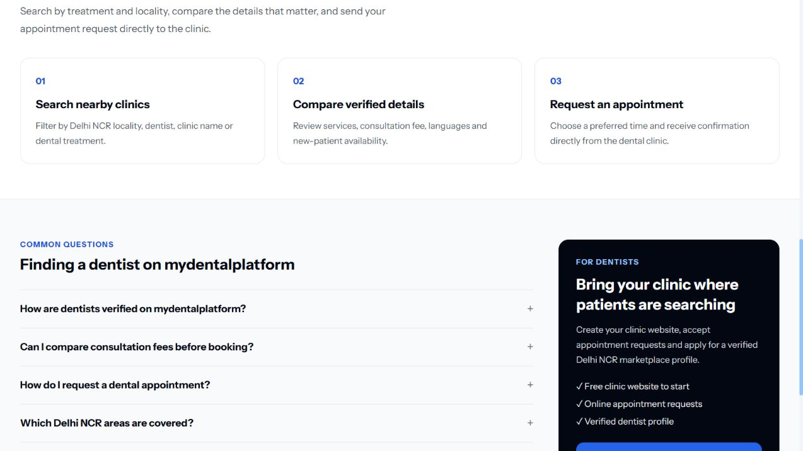
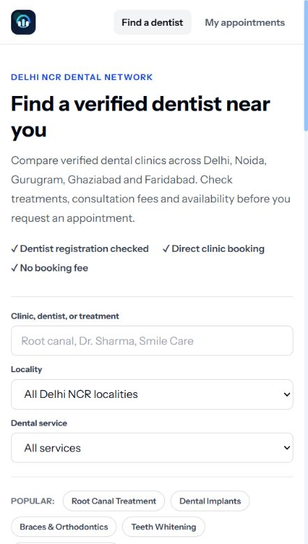

# Dentist marketplace audit

## Scope

The public `/dentists` discovery page, focusing on patient search, doctor acquisition, mobile clarity, accessibility signals, and crawlable SEO content.

## Step 1 — Current mobile entry

Health: Needs improvement.

- The search controls are clear and properly labelled.
- The empty directory dominates the experience and gives patients no useful next step.
- The clinic acquisition action is small and appears only inside the empty state.
- The brand name is clipped in the mobile header.
- A raw crawler receives the generic software title and almost no marketplace content because this route is client-rendered.

## Step 2 — Improved search entry

Health: Good.

- The opening copy names the supported Delhi NCR areas and explains the patient outcome.
- Verification, direct booking, and the lack of a booking fee are visible before search.
- Popular treatments provide fast starting points and use native buttons.
- Search fields retain visible labels and keyboard-friendly native controls.
- The local preview cannot load live listings without the Java API; the production API remains the data source.

## Step 3 — Patient guidance and doctor acquisition

Health: Good.

- Patients get a simple search, compare, request flow.
- Visible FAQs answer verification, fee, booking, and coverage questions.
- Doctors get a prominent clinic-listing path with clear benefits.
- FAQ disclosure controls use native `details` and `summary` elements.

## Step 4 — Live mobile release

Health: Good.

- The mobile header no longer clips the brand name.
- Search, trust points and popular treatments fit the narrow viewport without horizontal overflow.
- The live response loads the empty marketplace state cleanly while verified clinics are still being onboarded.

## SEO changes

- `/dentists` is pre-rendered, so crawlers receive the correct title, description, canonical URL, headings, FAQs, and business content without running JavaScript.
- Added `CollectionPage`, `MedicalBusiness`, breadcrumb, and visible FAQ structured data.
- The sitemap already contains `/dentists`, and robots.txt allows it.

## Evidence limits

Screenshots support visual hierarchy and visible semantics. Full keyboard navigation, screen-reader announcements, color contrast measurements, and live clinic-card content still require dedicated testing with production data.
