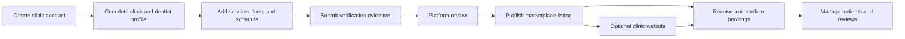

# Product architecture

## Product decision

MyDentalPlatform is an appointment marketplace first. The clinic software and clinic websites create and retain the supply that makes the marketplace useful.

The product has three clear surfaces under one brand:

| Surface | User | Purpose | Primary route or host |
|---|---|---|---|
| Patient marketplace | Patients | Discover, compare, and book verified dentists | `mydentalplatform.com/dentists` |
| Clinic workspace | Clinic owners and staff | Manage dentists, schedules, patients, bookings, verification, and website content | `mydentalplatform.com/business` |
| Clinic website | A clinic's patients | Learn about one clinic and book through the same scheduling system | `{clinic}.mydentalplatform.com` or the clinic's custom domain |

The marketplace is the main product. A clinic website is an optional acquisition channel for a clinic. Both create appointments through the same booking service and write to the same clinic calendar.

## User flows

### Patient flow

```mermaid
flowchart LR
    A[Describe problem] --> B[Choose location]
    B --> C[Compare verified dentists]
    C --> D[Choose a live slot]
    D --> E[Enter patient details]
    E --> F[Appointment request]
    F --> G[Clinic confirms]
    G --> H[Reminders]
    H --> I[Visit]
    I --> J[Verified review]
```



Patients should never need to understand the clinic website product. Their global navigation is limited to Find a dentist, My appointments, and urgent-care help.

### Clinic flow



The clinic workspace sells one result: more managed appointments. Website editing, CRM, reminders, and analytics support that result.

### Platform operations flow

Platform staff review provider evidence, moderate reviews, handle clinic status, and monitor marketplace quality. Staff routes and permissions remain separate from clinic administration.

## Domain boundaries

Keep a modular Spring Boot application while traffic and team size are small. Each domain owns its data access and exposes services to other domains; controllers must not query another domain's tables directly.

| Domain | Owns |
|---|---|
| Identity | Users, sessions, roles, password recovery |
| Clinics | Clinic identity, locations, staff, subscription state |
| Providers | Dentists, qualifications, registrations, verification evidence |
| Catalogue | Treatments, fees, languages, clinic capabilities |
| Scheduling | Working hours, doctor schedules, slots, holds |
| Booking | Appointment lifecycle and patient appointment access |
| Marketplace | Search projection, ranking, dentist and clinic profiles |
| Patients | Patient identity and clinic-scoped patient history |
| Reputation | Reviews, moderation, clinic responses, rating aggregates |
| Notifications | Email and WhatsApp jobs, retries, delivery state |
| Site publishing | Clinic theme, pages, media, domains, published version |
| Billing | Plans, entitlements, subscriptions, payment events |

Do not split these into networked microservices yet. First enforce package boundaries and asynchronous events inside the modular monolith. Split a domain only after independent scaling or ownership becomes necessary.

## Data model rules

1. Every clinic-owned record carries `clinic_id`; every clinic query is tenant-scoped.
2. Dentist identity, clinic membership, and location are separate. One dentist may later practise at multiple locations.
3. Appointment, slot, patient, and review data are relational columns. Flexible presentation content may use JSONB.
4. Separate these clinic concepts instead of growing one `public_config` document indefinitely:
   - `clinic_profiles`: legal and contact identity
   - `clinic_locations`: address, coordinates, timezone
   - `provider_profiles` and `provider_registrations`
   - `marketplace_listings`: publish state, discovery copy, search attributes
   - `site_versions`: clinic website content and theme
5. Marketplace reads use a denormalized search projection. Clinic updates rebuild that projection after verification.
6. A slot hold has a short expiry. Creating an appointment and consuming the hold happens in one database transaction.
7. Notification delivery uses an outbox record so a successful booking cannot lose its confirmation event.
8. Store timestamps in UTC and render them in the clinic location's timezone.

## API boundaries

Move toward versioned, role-specific APIs:

```text
/api/v1/public/marketplace/*      search, profiles, availability
/api/v1/public/bookings/*         create, claim, reschedule, cancel
/api/v1/clinic/*                  clinic workspace operations
/api/v1/platform/*                verification and moderation
/api/v1/integrations/*            provider webhooks
```

Existing endpoints can remain as compatibility routes while Angular moves one feature at a time. Public responses use stable DTOs and never expose clinic configuration documents directly. This boundary also makes a future ChatGPT app or public booking API safe to support.

## Permissions

| Role | Access |
|---|---|
| Patient | Own claimed appointments and profile |
| Clinic receptionist | Clinic appointments and patients |
| Clinic practitioner | Own schedule and assigned appointments |
| Clinic owner | All clinic data, staff, listing, website, billing |
| Platform reviewer | Verification and review moderation |
| Platform administrator | Platform operations and access control |

Clinic and platform authorization must be enforced by Spring. Angular guards improve navigation but are not security controls.

## Scalable deployment path

### Current stage

- One Angular and Spring Docker service on Render
- One Supabase PostgreSQL database
- Modular packages in Spring
- Database-backed notification jobs
- PostgreSQL indexes and a marketplace read projection

### Growth stage

- Add Redis for rate limits, short slot holds, and hot search responses
- Run notification and projection jobs in a separate worker process
- Store clinic media in object storage with image transformations
- Add PostgreSQL full-text and geospatial search before adopting a separate search engine
- Add read replicas only after measured database pressure

### Scale stage

- Extract notifications and search indexing first because they are asynchronous
- Partition appointments by time only when table size and query plans justify it
- Use a dedicated search service only when PostgreSQL search no longer meets latency or ranking needs

## Product navigation

The platform domain should make the two audiences explicit:

- Main patient CTA: **Find a dentist**
- Secondary professional link: **For clinics**
- Clinic landing CTA: **Join the appointment network**
- Clinic workspace CTA: **Manage appointments**
- Website feature language: **Your clinic website, connected to your calendar**

Avoid presenting website creation as the company category. It is a clinic feature within the appointment network.

## Delivery sequence

### P0: marketplace trust and booking reliability

- Complete real clinic and dentist verification data
- Publish bookable schedules and enforce transactional slot holds
- Keep dentist cards decision-complete with live availability, fee, location, and verified evidence
- Measure search-to-profile, profile-to-slot, and slot-to-booking conversion

### P1: clinic supply engine

- Turn onboarding into a listing readiness checklist
- Add role-based clinic staff access
- Move clinic profile, provider evidence, listing, and site content into separate models
- Add booking confirmation SLA and operational dashboard

### P2: platform and API growth

- Introduce `/api/v1` DTOs and compatibility adapters
- Add transactional outbox and worker
- Publish an authenticated availability and booking API for partners and ChatGPT integrations
- Add ranking signals from availability, completeness, distance, quality, and response time

## Core metrics

- Searches with at least one eligible result
- Search-to-profile conversion
- Profile-to-slot selection conversion
- Slot-to-booking completion
- Clinic confirmation rate and median confirmation time
- Appointment completion and cancellation rates
- Verified review rate
- Active clinics with bookable availability in the next seven days

