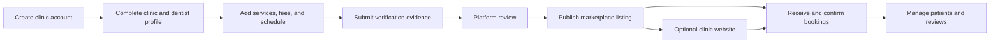

# Product architecture

## Active direction: simplify the existing product

As of 2026-09-27, consolidation takes priority over feature development. Keep the current stack and behavior while reducing duplication and making existing screens consistent. Future-looking domain and API proposals below are architectural context, not a mandate to add capabilities or migrate all routes at once.

### Initial repository findings

- `src/design-system.css` already owns semantic tokens and controls, but both it and `src/styles.css` contain shared styling and compatibility rules. Consolidate ownership through verified consumer migrations; do not add a third design system or remove legacy selectors without checking their usage and cascade.
- `PasswordLoginComponent` already provides shared authentication UI. Reuse it and audit its surrounding patient, professional, and business screens before introducing more form abstractions.
- Large admin dashboard/settings and clinic-form templates are candidates for responsibility-based extraction. File size alone does not establish that a component should be split.
- `ProviderWorkspaceController` performs SQL queries and documents legacy doctor/provider compatibility. Move cohesive business/data responsibilities behind domain services incrementally, preserving query scope and transaction behavior. Follow `backend/LEGACY_COMPATIBILITY.md` before removing fallback logic.

These are code inspection findings, not a completed visual or functional audit.

### Consolidation sequence

1. Inventory current routes from `src/app/app.routes.ts` and the business route file, including guarded and tenant routes. Track each screen's shared shell, primary action, form/list patterns, responsive behavior, and verification evidence.
2. Consolidate existing UI primitives: typography, spacing, colours, buttons, inputs, validation, status messages, cards, and tables. Use `docs/DESIGN_SYSTEM.md` as the common specification; migrate consumers and remove their superseded styles in the same reviewed change where practical.
3. Apply the common patterns to complete existing journeys: authentication/recovery, patient discovery and booking, dentist profile and workspace, then clinic and platform administration. Keep navigation appropriate to each role while standardizing common interactions. Preserve tenant branding through tokens.
4. Simplify frontend responsibilities where the audit finds duplication: components own presentation and interaction, domain services own API access, and guards/authentication services retain access checks. Avoid creating a generic service or component that merely hides unrelated behavior behind flags.
5. Simplify backend responsibilities one domain at a time. Keep HTTP mapping/validation in controllers, business rules and transaction boundaries in services, and cohesive database access in the owning domain. Preserve request/response contracts and existing database behavior; do not introduce layers without a concrete reduction in duplication or coupling.
6. Verify the migrated journeys, remove demonstrated dead code, and update the existing architecture/design/readiness documentation with evidence and remaining gaps.

### Evidence required for completion

Clinic Doctors now opens within Clinic Settings at `settings?tab=doctors`, alongside Plan and the existing settings sections. The legacy `clinic/doctors` URL redirects into that flow. The settings container checks the doctor-management entitlement before creating the existing doctor component; backend permissions remain unchanged. The component uses the settings header and account menu, with its own section heading and add action. Loading, retry, empty, and existing edit/delete interactions remain in the reused component; an error no longer also shows the empty-state add prompt.

Validation on 2026-10-02: lint and Angular production build passed. Authenticated desktop/mobile layout, keyboard/modal interactions, and live doctor save/delete actions still require browser verification with an isolated API/database.

For each migrated screen, record desktop and narrow-screen checks, keyboard/focus behavior, applicable loading/empty/error/success states, and its primary user action against the real application. Record responsive or accessibility exceptions rather than silently declaring them covered.

Run focused tests plus lint/build appropriate to each change. Backend refactors require relevant service/integration tests, including tenant isolation and ownership when affected. Browser journeys require an isolated database; compiled artifact smoke checks are not browser tests. Use `docs/LAUNCH_READINESS.md` for deployment acceptance and keep unverified external integrations explicitly open.

The completion target is a consistent, maintainable project with passing acceptance evidence and documented limitations. This initial consolidation direction does not certify every screen or production integration.

## Product decision

MyDentalPlatform is an appointment marketplace first. The clinic software and clinic websites create and retain the supply that makes the marketplace useful.

The patient discovery entry point is `/dentists`. `/business` and `/professional` provide dedicated clinic and dentist entry pages. `/book` opens patient discovery with booking filters preserved. `/account` provides sign-in and account creation for patients, dentists, and clinics; existing login URLs and duplicate dentist signup URLs redirect to it. Sign-in opens the workspace associated with the authenticated role. Signup asks for account type and retains the recovery-code handoff before opening the workspace or clinic setup.

`/workspace` is the shared bookmark and navigation entry for an authenticated account. It waits for session restoration and selects the existing role-specific destination, whose guards still enforce permissions and subscription access. `/account/recovery` uses the same platform shell as sign-in; legacy business password-reset links redirect there. Mobile platform navigation offers discovery, appointments (or the staff workspace), and sign-in (or account security).

These journeys remain separate permission boundaries under one brand:

The patient appointment screen keeps booking, confirmation status and visit actions in one column. Linking an older guest booking is expandable and opens automatically for a booking-reference link. Dentist setup shows the next action from the saved practice, hours and verification state; workspace task selection is retained in the URL. Clinic signup keeps required clinic details, services/hours and plan selection in three steps, with website colours and preview optional. These changes reuse the existing forms and do not change identity or marketplace publication rules.

| Surface | User | Purpose | Primary route or host |
|---|---|---|---|
| Patient marketplace | Patients | Discover, compare, and book verified dentists | `mydentalplatform.com/dentists` |
| Dentist workspace | Dentists | Manage their profile, availability, and appointments | `mydentalplatform.com/professional/workspace` |
| Clinic workspace | Clinic owners and staff | Manage dentists, schedules, patients, bookings, verification, and website content | `mydentalplatform.com/business/clinic/dashboard` |
| Clinic website | A clinic's patients | Learn about one clinic and book through the same scheduling system | `{clinic}.mydentalplatform.com` or the clinic's custom domain |

The marketplace is the main product. A clinic website is an optional acquisition channel for a clinic. Both create appointments through the same booking service and write to the same clinic calendar.

## User flows

### Patient flow


```mermaid
flowchart LR
    A[Describe problem] --> B[Choose location]
    B --> C[Compare verified dentists]
    C --> D[Choose a live slot]
    D --> E[Enter patient details]
    E --> F[Appointment request]
    F --> G[Clinic confirms]
    G --> H[Reminders]
    H --> I[Visit]
    I --> J[Verified review]
```

Patients should never need to understand the clinic website product. Shared navigation provides Find a dentist, My appointments, and Sign in (or the authenticated account/workspace). Dentist and clinic signup links appear on the shared home page.

### Clinic flow


```mermaid
flowchart LR
    A[Create clinic account] --> B[Complete clinic and dentist profile]
    B --> C[Add services, fees, and schedule]
    C --> D[Submit verification evidence]
    D --> E[Platform review]
    E --> F[Publish marketplace listing]
    F --> G[Receive and confirm bookings]
    G --> H[Manage patients and reviews]
    F --> I[Optional clinic website]
    I --> G
```

The clinic workspace sells one result: more managed appointments. Website editing, CRM, reminders, and analytics support that result.

### Platform operations flow

Platform staff review provider evidence, moderate reviews, handle clinic status, and monitor marketplace quality. Staff routes and permissions remain separate from clinic administration.

## Domain boundaries

Keep a modular Spring Boot application while traffic and team size are small. Each domain owns its data access and exposes services to other domains; controllers must not query another domain's tables directly.

| Domain | Owns |
|---|---|
| Identity | Users, sessions, roles, password recovery |
| Clinics | Clinic identity, locations, staff, subscription state |
| Providers | Dentists, qualifications, registrations, verification evidence |
| Catalogue | Treatments, fees, languages, clinic capabilities |
| Scheduling | Working hours, doctor schedules, slots, holds |
| Booking | Appointment lifecycle and patient appointment access |
| Marketplace | Search projection, ranking, dentist and clinic profiles |
| Patients | Patient identity and clinic-scoped patient history |
| Reputation | Reviews, moderation, clinic responses, rating aggregates |
| Notifications | Email and WhatsApp jobs, retries, delivery state |
| Site publishing | Clinic theme, pages, media, domains, published version |
| Billing | Plans, entitlements, subscriptions, payment events |

Do not split these into networked microservices yet. First enforce package boundaries and asynchronous events inside the modular monolith. Split a domain only after independent scaling or ownership becomes necessary.

## Data model rules

1. Every clinic-owned record carries `clinic_id`; every clinic query is tenant-scoped.
2. Dentist identity, clinic membership, and location are separate. One dentist may later practise at multiple locations.
3. Appointment, slot, patient, and review data are relational columns. Flexible presentation content may use JSONB.
4. Separate these clinic concepts instead of growing one `public_config` document indefinitely:
   - `clinics`: clinic legal and contact identity
   - `practice_locations`: clinic-owned or independently owned practice locations
   - `providers`: dentist identity, credentials and verification state
   - `provider_location_memberships`: accepted dentist-to-location relationships, fees and schedules
   - `provider_services`: treatments offered by each dentist
   - `provider_marketplace_listings`: publish state and discovery data
   - `site_versions`: clinic website content and theme
5. Marketplace reads use a denormalized search projection. Clinic updates rebuild that projection after verification.
6. A slot hold has a short expiry. Creating an appointment and consuming the hold happens in one database transaction.
7. Notification delivery uses an outbox record so a successful booking cannot lose its confirmation event.
8. Store timestamps in UTC and render them in the clinic location's timezone.

## API boundaries

Move toward versioned, role-specific APIs:

```text
/api/v1/public/marketplace/*      search, profiles, availability
/api/v1/public/bookings/*         create, claim, reschedule, cancel
/api/v1/clinic/*                  clinic workspace operations
/api/v1/platform/*                verification and moderation
/api/v1/integrations/*            provider webhooks
```

Existing endpoints can remain as compatibility routes while Angular moves one feature at a time. Public responses use stable DTOs and never expose clinic configuration documents directly. This boundary also makes a future ChatGPT app or public booking API safe to support.

## Permissions

| Role | Access |
|---|---|
| Patient | Own claimed appointments and profile |
| Clinic receptionist | Clinic appointments and patients |
| Clinic practitioner | Own schedule and assigned appointments |
| Clinic owner | All clinic data, staff, listing, website, billing |
| Platform reviewer | Verification and review moderation |
| Platform administrator | Platform operations and access control |

Clinic and platform authorization must be enforced by Spring. Angular guards improve navigation but are not security controls.

## Scalable deployment path

### Current stage

- One Angular and Spring Docker service on Render
- One Supabase PostgreSQL database
- Modular packages in Spring
- Database-backed notification jobs
- PostgreSQL indexes and a marketplace read projection

### Growth stage

- Add Redis for rate limits, short slot holds, and hot search responses
- Run notification and projection jobs in a separate worker process
- Store clinic media in object storage with image transformations
- Add PostgreSQL full-text and geospatial search before adopting a separate search engine
- Add read replicas only after measured database pressure

### Scale stage

- Extract notifications and search indexing first because they are asynchronous
- Partition appointments by time only when table size and query plans justify it
- Use a dedicated search service only when PostgreSQL search no longer meets latency or ranking needs

## Product navigation

The platform domain should make the two audiences explicit:

- Main patient CTA: **Find a dentist**
- Dentist portal: **`/professional`** for an independently owned profile and practice locations
- Secondary professional link: **For clinics**
- Clinic landing CTA: **Join the appointment network**
- Clinic workspace CTA: **Manage appointments**
- Website feature language: **Your clinic website, connected to your calendar**

Avoid presenting website creation as the company category. It is a clinic feature within the appointment network.

## Delivery sequence

### P0: marketplace trust and booking reliability

- Complete real clinic and dentist verification data
- Publish bookable schedules and enforce transactional slot holds
- Keep dentist cards decision-complete with live availability, fee, location, and verified evidence
- Measure search-to-profile, profile-to-slot, and slot-to-booking conversion

### P1: clinic supply engine

- Turn onboarding into a listing readiness checklist
- Add role-based clinic staff access
- Move clinic profile, provider evidence, listing, and site content into separate models
- Add booking confirmation SLA and operational dashboard

### P2: platform and API growth

- Introduce `/api/v1` DTOs and compatibility adapters
- Add transactional outbox and worker
- Publish an authenticated availability and booking API for partners and ChatGPT integrations
- Add ranking signals from availability, completeness, distance, quality, and response time

## Core metrics

- Searches with at least one eligible result
- Search-to-profile conversion
- Profile-to-slot selection conversion
- Slot-to-booking completion
- Clinic confirmation rate and median confirmation time
- Appointment completion and cancellation rates
- Verified review rate
- Active clinics with bookable availability in the next seven days
