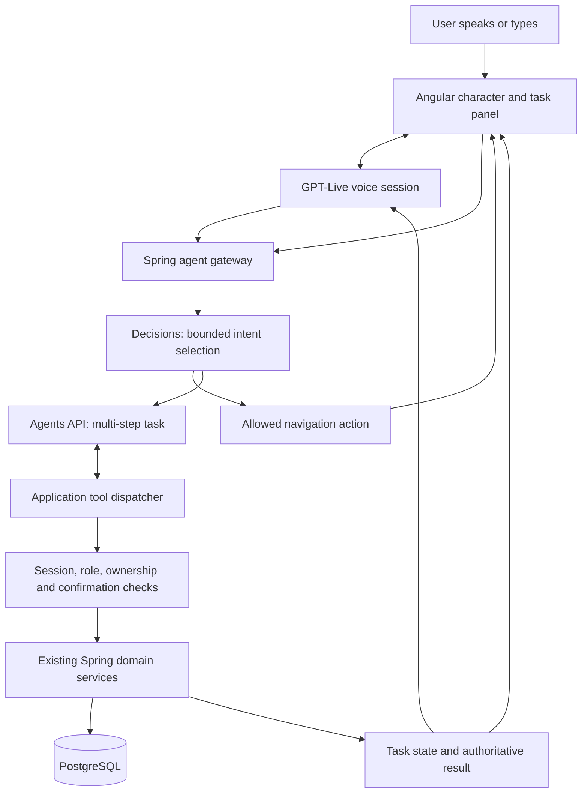

# MyDentalPlatform voice action agent

Status: architecture proposal, 11 October 2026. No voice agent is enabled in
production. OpenAI Platform rejected project discovery during setup; no project
selection, key creation, model-access check or live API request has succeeded.

## Product contract

The user wants an expressive character that listens, navigates and completes
platform tasks. The primary interaction is a spoken goal followed by visible
progress and a real result. Typing and existing controls remain available.
The 20-second target applies to common actions after authentication and required
details are available; onboarding can need additional conversation.

Use an original dental character with a soft rounded silhouette, expressive
eyes and the existing teal/blue palette. Movement communicates idle, listening,
working, awaiting confirmation, speaking, success and recovery. A thinking
animation cannot stand in for an actual task status. Respect reduced motion,
keep captions visible, provide mute/stop, and release microphone tracks on stop.
Do not copy ChatGPT's character artwork or imply this is an OpenAI product.

## Verified OpenAI API direction

Official documentation inspected on 11 October 2026:

- [GPT-Live](https://developers.openai.com/api/docs/guides/live) supports a spoken
  conversation while delegated backend work continues. Use client delegation
  to connect the voice experience to this application's action runtime.
- [Decisions](https://developers.openai.com/api/docs/guides/decisions) selects
  typed answers such as choices, probabilities and scores. It is documented as
  public beta with `gpt-6-luna`; it is suitable for choosing among supported
  intents, not for granting permissions or generating arbitrary operations.
- [Voice with Decisions](https://developers.openai.com/api/docs/guides/decisions-voice)
  documents a voice delegation followed by application action execution and a
  result returned to the voice session. Track delegation IDs when returning
  results, including when the user interrupts or changes the request.
- [Agents API](https://developers.openai.com/api/docs/guides/agents-api/overview)
  provides managed sessions and orchestration. Use it for multi-step tasks that
  gather missing details, call application functions and retain task progress.
  A successful agent turn does not by itself establish that a clinic was saved.

Use GPT-Live for conversation, Decisions for bounded routing and Agents for
multi-step execution. Do not send every simple navigation request through all
three. Before integration, verify API and model access in the selected project,
read the current request/event contracts, and pin validated versions. A model
catalog entry or an API key alone does not prove access to every API.

## Architecture

Keep Angular and Spring as the application stack. Add a separate agent module
inside Spring with provider adapters, a task coordinator, tool definitions and
an action dispatcher. The character must not contain business authorization.
Application tools call domain services, rather than click selectors or execute
model-generated SQL. The OpenAI secret stays server-side; browser voice setup
uses the documented short-lived credential/session exchange for the chosen API.

Start with one task agent. Use OpenAI-hosted execution when a sandbox is needed;
do not place production database credentials in that sandbox. Application
function responders remain responsible for all domain access and survive a
voice disconnect. Specify environment and retention settings after the access
check; there is no need to add a second application server solely for the SDK.

## Action contract

Every tool has a versioned input schema, allowed roles, server validation,
confirmation policy, idempotency policy and a structured result. The server
derives identity and clinic scope from the verified session, never model input.
Return one of `needs_input`, `needs_confirmation`, `succeeded`, `failed` or
`unsupported`, plus an application task ID and a permitted next destination.
These are proposed application statuses, not OpenAI API event names.

| Action | Behavior | Boundary |
| --- | --- | --- |
| Open a page | Resolve a known destination in Angular | Router guards still apply; no arbitrary URLs |
| Find appointments | Read current user's eligible appointments | Patient ownership or staff clinic scope |
| Prepare clinic | Collect name, phone, location and proposed subdomain | Draft only; no role change |
| Create clinic | Persist a reviewed draft | Eligible ownership flow, current session, one confirmation |
| Book or reschedule | Check availability and submit the selected request | Existing verification, consent, slot hold and ownership |
| Update clinic settings | Preview the exact changed fields and save | Clinic permission and settings validation |
| Cancel or pay | Present the specific cancellation or checkout | Explicit confirmation; existing payment provider handles payment |

Simple navigation and reads should execute directly. Drafts should update as
the user speaks. Confirm once at a meaningful write boundary, not after every
sentence. Bind confirmation to actor, task, draft version and exact payload;
invalidate it when details change. The model cannot approve its own proposal.

## First complete workflow: create my clinic

1. The character hears “I'm a dentist; create my clinic.” Resolve the signed-in
   account and explain any sign-in requirement using the existing account flow.
2. Ask only for missing required details. Read back names and phone numbers for
   correction; do not invent an address, qualification, hours or consent.
3. Prepare a clinic draft and check the proposed subdomain. Explain the selected
   plan and any cost before accepting the creation confirmation.
4. Show a short preview and accept a spoken or clicked confirmation bound to
   that version of the draft.
5. Recheck permissions and availability, perform one transaction, then return
   the persisted clinic ID. Open the permitted workspace and describe any
   remaining verification or publication steps accurately.

### Existing account-model blocker

`ClinicOnboardingService.create` currently accepts only an `incomplete_signup`
account, creates an unlisted clinic, and changes that account to `clinic_admin`.
An existing `dentist` account cannot use this workflow. The agent must not
remove the guard or relabel the dentist account to bypass it.

The new owner flow needs explicit clinic membership in addition to the dentist
identity. Add a migration and domain command that creates the clinic plus its
owner membership while retaining the provider profile. Introduce an explicit
active workspace scope, reissue appropriately scoped sessions, and update the
affected guards and role checks as one tested migration. Test existing dentist,
clinic-admin, patient and platform-admin sessions before release. This is a
prerequisite for promising the example to existing dentist users; until then,
only the existing eligible clinic-signup path can create a clinic.

## Task execution and recovery

- Persist task actor, scope, draft version, confirmation, action ID and outcome.
  Use unique idempotency keys for writes. On timeout, reconcile the saved result
  before retrying; reconnecting must not create a second clinic or booking.
- Stream application progress to the UI. Speech interruption stops speech;
  task cancellation is a separate explicit action. Report a write that already
  committed rather than pretending interruption undid it.
- Allow only tools registered for the current actor. Retrieved pages, clinic
  descriptions and transcripts are input data, not instructions that can change
  the tool policy. Handle ambiguous commands with a short clarification.
- Keep passwords, recovery codes, payment credentials and unrelated patient
  records outside model context. Send only the fields needed for the current
  task. Define transcript retention and deletion before enabling real users.
- Enforce per-user usage limits and a session duration cap. Surface a truthful
  retry state for provider errors. Keep normal platform controls available.

## Implementation sequence and acceptance

1. Restore OpenAI Platform access, select the named project, confirm the secret's
   local destination, and validate API access with a bounded synthetic request.
2. Implement the original character, captions and persisted task panel behind
   a disabled-by-default feature flag. Verify keyboard and reduced-motion use.
3. Connect live voice to allowed navigation and read-only actions. Test spoken
   corrections, interruption, microphone denial and provider disconnects.
4. Implement clinic ownership/membership and the confirmed create-clinic tool.
   Prove one successful spoken creation in an isolated database, including a
   duplicate-delivery test and negative cross-account authorization tests.
5. Add booking, rescheduling, clinic settings and staff appointment actions one
   at a time with the same action contract and recorded acceptance evidence.
6. Enable a limited production pilot only after authenticated end-to-end tests,
   cost controls and observed latency pass. Measure human task time; do not
   claim every workflow finishes in 20 seconds from an automated test.

The current `/api/chat`, `/api/voice-session` and related optional endpoints
return 503. Keep that truthful behavior until the replacement is configured
and tested. This document does not activate AI, create a key, or certify any
voice workflow as delivered.
